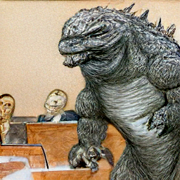

# min(DALL·E)

[](https://colab.research.google.com/github/kuprel/min-dalle/blob/main/min_dalle.ipynb) &nbsp;
[](https://replicate.com/kuprel/min-dalle)

This is a minimal implementation of Boris Dayma's [DALL·E Mini](https://github.com/borisdayma/dalle-mini) in PyTorch.  It has been stripped to the bare essentials necessary for doing inference.  The only third party dependencies are numpy and torch.

It currently takes **7.4 seconds** to generate an image with DALL·E Mega with PyTorch on a standard GPU runtime in Colab

The flax model, and the code for coverting it to torch, have been moved [here](https://github.com/kuprel/min-dalle-flax).

### Install

```zsh
$ pip install min-dalle
```  

### Usage

Use the python script `image_from_text.py` to generate images from the command line.

```zsh
$ python image_from_text.py --text='artificial intelligence' --seed=7
```


```zsh
$ python image_from_text.py --text='court sketch of godzilla on trial' --mega
```


To load a model once and generate multiple times, initialize `MinDalleTorch`, then call `generate_image` with some text and a seed.

```python
from min_dalle import MinDalleTorch

model = MinDalleTorch(
    is_mega=True, 
    is_reusable=True,
    models_root='./pretrained'
)
```

```python
image = model.generate_image("a comfy chair that looks like an avocado")
display(image)
```

```python
image = model.generate_image("trail cam footage of gollum eating watermelon", seed=1)
display(image)
```


Model parameters will be downloaded as needed to the directory specified.  The models can also be manually downloaded [here](https://huggingface.co/kuprel/min-dalle/tree/main).