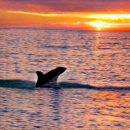

# min(DALL·E)

[](https://colab.research.google.com/github/kuprel/min-dalle/blob/main/min_dalle.ipynb)

This is a minimal implementation of [DALL·E Mini](https://github.com/borisdayma/dalle-mini).  It has been stripped to the bare essentials necessary for doing inference, and converted to PyTorch.  The only third party dependencies are numpy, torch, and flax (and optionally wandb to download the models).  DALL·E Mega inference with PyTorch takes about 10 seconds in Colab.

## Setup

> See [Docker setup](#docker-setup) below.

Run `sh setup.sh` to install dependencies and download pretrained models.  The models can also be downloaded manually here:
[VQGan](https://huggingface.co/dalle-mini/vqgan_imagenet_f16_16384),
[DALL·E Mini](https://wandb.ai/dalle-mini/dalle-mini/artifacts/DalleBart_model/mini-1/v0/files),
[DALL·E Mega](https://wandb.ai/dalle-mini/dalle-mini/artifacts/DalleBart_model/mega-1-fp16/v14/files)

## Usage

Use the python script `image_from_text.py` to generate images from the command line.  Note: the command line script loads the models and parameters each time.  To load a model once and generate multiple times, initialize either `MinDalleTorch` or `MinDalleFlax`, then call `generate_image` with some text and a seed.  See the colab for an example.

## Docker setup

Container with access to hosts' NVIDIA GPU.

```bash
# build image locally and tag it
docker build . -t localhost/min-dalle:latest

# download artifacts to bind-mounted volume
docker run -v "$PWD/pretrained:/min-dalle/pretrained" -it --rm localhost/min-dalle:latest /min-dalle/setup.sh

# run min(DALL·E)!
docker run -v "$PWD/pretrained:/min-dalle/pretrained" -v "$PWD/generated:/min-dalle/generated:Z" -it --rm --gpus all localhost/min-dalle:latest
```

Run it with a custom query:

```bash
docker run -v "$PWD/pretrained:/min-dalle/pretrained" -v "$PWD/generated:/min-dalle/generated:Z" -it --rm --gpus all localhost/min-dalle:latest python image_from_text.py --text='whales at sunset' --torch --image_path='./generated'
```



## Examples

```bash
python image_from_text.py --text='artificial intelligence' --torch
```


```bash
python image_from_text.py --text='a comfy chair that looks like an avocado' --torch --mega --seed=10
```


```bash
python image_from_text.py --text='court sketch of godzilla on trial' --mega --seed=100
```


