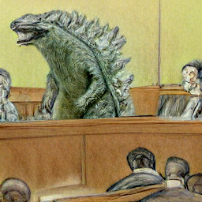

# min(DALL·E)

[](https://colab.research.google.com/github/kuprel/min-dalle/blob/main/min_dalle.ipynb)

This is a minimal implementation of [DALL·E Mini](https://github.com/borisdayma/dalle-mini).  It has been stripped to the bare essentials necessary for doing inference, and converted to PyTorch.  The only third party dependencies are `numpy`, `torch`, and `flax`.

### Setup

Run `sh setup.sh` to install dependencies and download pretrained models.  The `wandb` python package is installed to download DALL·E mini and DALL·E mega.  Alternatively, the models can be downloaded manually here: 
[VQGan](https://huggingface.co/dalle-mini/vqgan_imagenet_f16_16384), 
[DALL·E Mini](https://wandb.ai/dalle-mini/dalle-mini/artifacts/DalleBart_model/mini-1/v0/files), 
[DALL·E Mega](https://wandb.ai/dalle-mini/dalle-mini/artifacts/DalleBart_model/mega-1-fp16/v14/files)

### Usage

The simplest way to get started is the command line python script `image_from_text.py` provided.  Here are some examples runs:

```
python image_from_text.py --text='alien life' --seed=7
```


```
python image_from_text.py --text='a comfy chair that looks like an avocado' --mega --seed=4
```


```
python image_from_text.py --text='court sketch of godzilla on trial' --mega --seed=100
```



### Load once run multiple times

The command line script loads the models and parameters each time.  The colab notebook demonstrates how to load the models once and run multiple times.